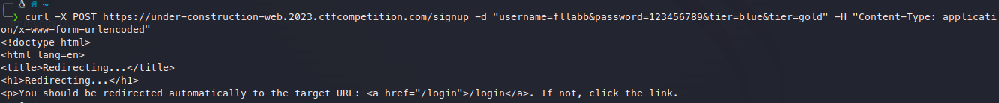
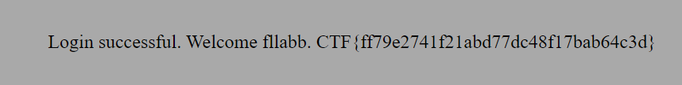

This challange is about migrating from python to PHP.

the PHP app doesn't have any input validation, but we can't immediately curl to the PHP app, because we need the token. the token is in python app, but we can't curl to the python app from the PHP app, because the python app have input validation. the problem is, we can't use python app to request to the PHP
apps, because we can't use gold tier to get flag.

solution is using parameter pollution, because the parsing occurrence is different beetwen python and PHP, and the python passing raw post in request to PHP app, because of that we can use parameter pollution to get flag. \
(ref: https://book.hacktricks.xyz/pentesting-web/parameter-pollution)

`Flag: CTF{ff79e2741f21abd77dc48f17bab64c3d}`