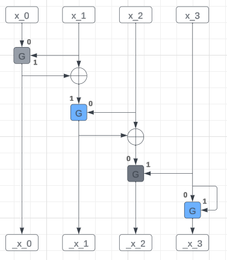

$$\begin{aligned}
    l &= l\\
    r &= r \oplus l \\
\end{aligned}
$$

$$\begin{aligned}
    x &= key \\
    rx_0 &= 3x_0 + 5x_1 \mod{2^8} \\
    rx_1 &= 3x_2 + 5(x_1 \oplus rx_0) + 7 \mod{2^8} \\
    rx_2 &= 3(x_2 \oplus rx_1) + 5x_3 \mod{2^8} \\
    rx_3 &= 3x_3 + 5x_3 + 7 \mod{2^8} \\
\end{aligned}
$$

**`f` Function**

**`G` Function**
$$\begin{aligned}
    BlueOutput &= 3 \cdot Input_0 + 5 \cdot Input_1 + 7 \mod{2^8} \\
    GreenOutput &= 3 \cdot Input_0 + 5 \cdot Input_1 \mod{2^8} \\
\end{aligned}
$$

#### Solve

the strategy is to finding differential thats same, firstly bruteforce $kx_0$ & $kx_1$ to get $nx_0$ differential, then bruteforce again in $kx_2$ & $kx_3$ to get rest differential, repeat on all round. (src: http://theamazingking.com/crypto-feal.php)